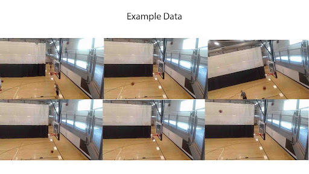

<h1>Intro</h1>
<b1> For this project I want to be able to track as many elements that I can from a basketball game. I think the most important is scoring so that would be a good starting point.</b1>

 
<h1>Data</h1>
<b1>

When collecting data I recorded roughly 2 hours of footage to be processed through 
[vids_to_frames.py](.py files/vid_to_frame.py). From those images I selected 900 of them which can be found in the files and videos folder.
 

</b1>
 
<b1> I used [labelimg](https://github.com/tzutalin/labelImg) to process all of my images. 
 
 ![[images and videos/labelimg.png]]</b1>
 
 <h1> Model </h1>
 <b1>
 ![[images and videos/yologo_2.png]] 
 
I used darknet for the yolov4 model which can be found [here](https://github.com/AlexeyAB/darknet). </b1>

<b1> This project was used for two of my classes and I can say I am happy about the results and would like to strive to advance this to a more complete system. I have a video of the current iteration below. 
  [[images and videos/vid2_yolov4_demo.mp4]]
